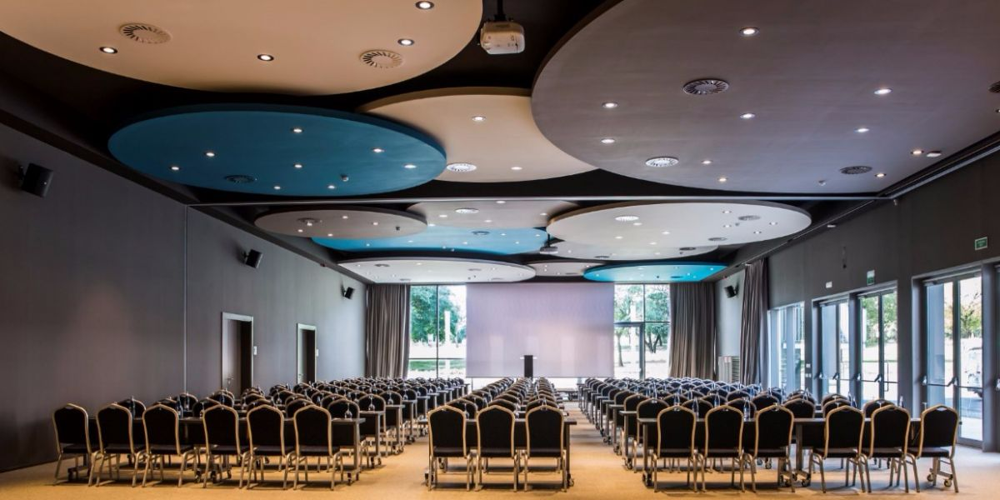
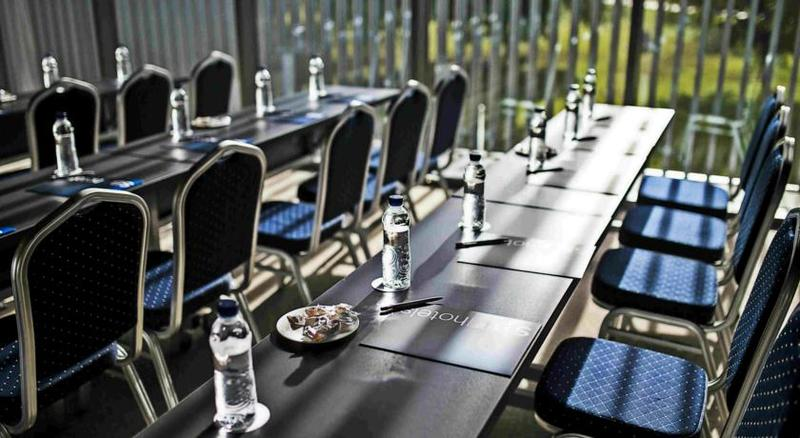
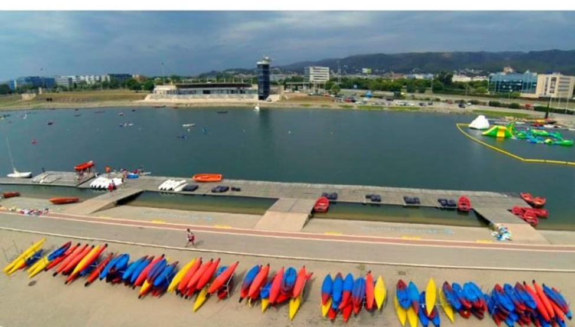
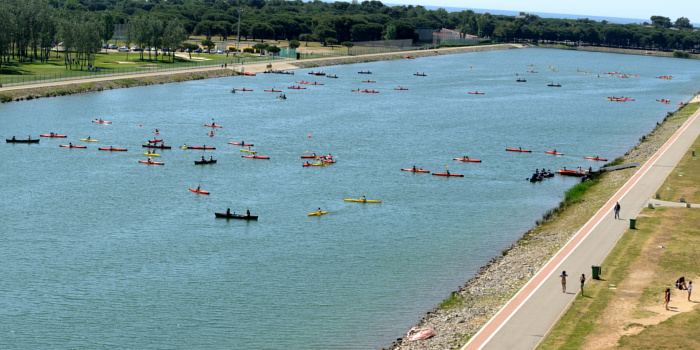
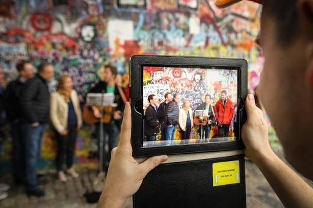

<style>
.list-group-item.active, .list-group-item.active:focus, .list-group-item.active:hover {
    background-color: #0099cc;
}
</style>

<style>
.nav>li>a {
    position: relative;
    display: block;
    padding: 10px 15px;
    color: #0099cc;
    font-weight: bold;
}
.nav-pills>li.active>a, .nav-pills>li.active>a:hover, .nav-pills>li.active>a:focus {
    color: white;
    background-color: #0099cc;
}
</style>


<script> 
    $(document).ready(function() { 
    $head = $('#header'); 
   $head.prepend('<A href = http://www.bettertravel.dk/en/></A>') 
    }); 
</script> 


```{r echo=FALSE, message=FALSE,warning=FALSE}
library(readxl)
library(dplyr)
library(knitr)
```

# ACCOMMODATION

## SB BCN EVENTS - CASTELLDEFELS

<iframe src="SB BCN Events/sb bcn.html" frameborder="0" width="100%" height="1280" scrolling="no"></iframe>

For the dates from 23rd Sept. to 26th. Sept. we offer the BCN 2 meeting room. 
A meeting room up to 200 people in theatre set up.
In this meeting room is included a screen, a projector and a notebook and pens for the guests. 

*Depending on the number of PC's / electronic devices conected to the Wi-Fi, maybe there is an extra cost for the Wi-Fi.*





</br>

# ACTIVITIES

## Teambuilding - Canal Olímpic de Catalunya

The "Canal Olímpic de Catalunya" is a canal located in Castelldefels that was constructed in 1991 towards the Barcelona Olympic Games in 1992. It hosted the flat-water canoeing competitions during the 1992 games. 

The facilities occupy 43 hectares, 15 of which correspond to the water surface, which is 1.200 meter long, 120 meters wide and 3.5 meters deep. The water channel is surrounded by a large extension of garden. 

Nowadays is still being used as a competitve spot. 




<iframe src="https://www.google.com/maps/d/u/0/embed?mid=1-9biuz-XQ1f1fLoutoO1ftsY8j00vLsi" width="100%" height="480"></iframe>

<br>

***How this will be structured?***

We will split the group in smaller groups of 9-10 people each. 
They will do 4 different activities every 30 minutes, with a minimum of 4 activities. 
6 teams would start with one activity, 6 teams another acitivity and the last group with other one. Once they will be finished with the first challenge all teams will change the activity in order that all the teams would go through the 4 challenges.

The schedule would be something like this:

* Arrival at Canal Olímpic: small brief and prepare all teh staff (30 minutes)

* Activity 1 (30 minutes)

* Activity 2 (30 minutes)

* Activity 3 (30 minutes)

* Activity 4 (30 minutes)

* Shower, dress up, etc. (30 minutes)

A total of 3 hours. 

There is the possibility to add some extra challenges. 5 instead of 4, but it has an extra charge that will be detailed in the budget. 

Some of the activities we suggest are:

* **Boat construcion**: With an specific material (provided by us), the team have to build an small boat and go for a flag on the other side of the "Canal" adn go back to the starter point. 

* **Boat to the floating island**: 4 participants per boat. Relay test. From the starter point, go shoving until reach a floating island. Esch team will have to pick up an inflatable and go back to the starter point. The team with more number of inflatable wins. 

* **Kayak(k-2)** : Relay test too. 2 participants per boat. and one boat per team. 

* **The bridge**: all the participants of the team must reach the other side of the circuit, walking on a drums.  

* **Pedal cars**: A relay test too. One or two cars per team. Consists on doing the most number of laps in the circuit. The team with more number of laps wins.

* **BIG SUP**: A gigant SUP table with capacity up to 8 people per team. Each team has one table. A race against the other teams. 

 

<br>

## Catamarán sailing

We also suggest a Catamaran actiivty along Barcelona's coastline. This is the biggest Catamaran in Barcelona up to 250 people. It has two different floors. This is an eco boat.

It features solarium, submarine vision, 2 toilets, a covered part, sound system, etc. 

The route is based on following the Barcelona skyline. A different sight of Barcelona. From the sea, guests will be able to see some of the most emblemathic buildings in the city, such as Sagrada Familia, Agbar Tower, tibidabo mountain, Forum, Montjuic mountain, etc. This activity takes about 3 hours aproximately. 


There is the possibility to include drinks and food during the sailing. 

The departure port scheduled is Olympic Port.

<iframe src="https://www.google.com/maps/d/u/0/embed?mid=15V2NwlpMWJBCJRUJ0qEXtt0qnTwuigGZ" width="100%" height="480"></iframe>

<br>

## Ipad treasure hunt

Ipad Treasure Hunt is one of the best ways to discover the city you are in. This activity will be carried out in Barcelona cty, only 15 minutes from Castelldefels by coach.
We also propose this activity for the whole group, as if it was a teambuilding. 

***How this will be structured?***

We will split the group in smaller groups. Each group will have an iPAD with a map where the different spots to visit will be marked with a sign. Each challenges will give different puntuation. The group will make their own plan in order to get the highest score.  

This is a teambuilding in a competition format. 

*One of the spots can be a bar/restaurant where guests will taste a traditional "tapa" and a drink (soft drnik, water or beer). This will be like an small break during the activity. This will have an extra charge in case of confirmation*



<iframe src="https://www.google.com/maps/d/u/0/embed?mid=1a0B3MNydgeT9DWlqJudv8j3UlvGArm3a" width="100%" height="480"></iframe>

<br>

# RESTAURANT OPTIONS / VENUES

## CBC Castelldefels

<iframe src="CBC/CBC.html" frameborder="0" width="100%" height="970" scrolling="no"></iframe>

CBC offers availability for the three days. It can be booked in exclusivity. Rates detailed in the budget.
Friday and Saturday open the doors to the public at 00:00 as it turns into a night club later, so it's not possible to have exclusivity after the dinner. Possible during the dinner. 

## Kauai

<iframe src="Kauai/Kauai.html" frameborder="0" width="100%" height="1200" scrolling="no"></iframe>

*There is also the option to organize a Paella contest in Kauai. Rates detailed in the budget.*

*****

# BUDGET


<iframe src="budgetparainsertar.html" frameborder="0" width="100%" height="2450" scrolling="no"></iframe>

</br>


# TERMS AND CONDITIONS

  * Rates valid for 2020
  
  * For a group of minimum 175 pax.
  
  * VAT included. 
  
  * No reservation has been done. Availability upon request.
  
*****


